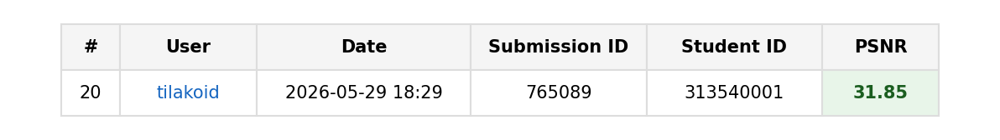

# Image Restoration with PromptIR

**NYCU Visual Recognition using Deep Learning (Spring 2026), Homework 4**

[](https://pytorch.org/)
[](https://github.com/va1shn9v/PromptIR)
[](https://www.codabench.org/competitions/16215/)

**Author:** Muhammad Rayhan Athaillah (賴瑞涵) | Student ID: 313540001 | NYCU

All-in-one **rain + snow** image restoration with a single **PromptIR** trained from scratch (no external data, no pretrained weights). Best public PSNR: **31.84 to 31.85** via prediction ensembling; best **single** checkpoint: **31.77** (Run 9, L1+MSE + TTA).

**Workflow:** Code on GitHub; `data/`, `PromptIR/data/`, `checkpoints/`, and `submission/*.zip` stay local (see `.gitignore`).

## CodaBench result

Public leaderboard entry (submission **765089**, `ensemble-r9-r8-r11avg5.zip`, 2026-05-29):



---

## Quick start

```bash
git clone https://github.com/RayhanHaqi/visual_recognition-hw4.git
cd visual_recognition-hw4

# Installs deps, clones PromptIR, downloads dataset, builds PromptIR/data layout
python setup.py

# Recommended training recipe (patch 256, L1+MSE, PSNR monitor)
bash train_stage1.sh

# Inference → submission zip with pred.npz inside
python inference.py checkpoints/<your-best>.ckpt --tta --output submission/stage1-tta.zip
```

Smaller patch if OOM:

```bash
PATCH_SIZE=192 BATCH_SIZE=1 bash train_stage1.sh
```

---

## Introduction

Restore 256×256 images degraded by **rain streaks** or **snow overlay** using one PromptIR model. Training uses 3,200 paired images (1,600 per type); validation 320; test 100 unlabeled images on CodaBench.

**Constraints (course):**

- PromptIR backbone (module changes allowed; document in report)
- Single model for both degradations (competition best uses inference-time ensemble of four PromptIR runs; see report)
- No external data; train from scratch

---

## Environment setup

```bash
pip install -r requirements.txt
# or full bootstrap:
python setup.py
```

`setup.py` will:

1. Install Python dependencies (and PyTorch nightly on RTX 50xx if detected)
2. Clone [va1shn9v/PromptIR](https://github.com/va1shn9v/PromptIR.git) into `PromptIR/`
3. Download the HW4 dataset from Google Drive into `data/hw4_realse_dataset/`
4. Run `prepare_data.py` → `PromptIR/data/{Train,Val,Test}`

**Hardware:** RTX 4090 recommended (BS 1 to 4 at patch 256). RTX 5090 was unstable in our runs (CUDA/cuDNN); use 4090 for long jobs.

---

## Usage

### Training

```bash
# Stage 1 with validation (default)
bash train_stage1.sh

# Custom run name / loss / patch
RUN_NAME=my-run PATCH_SIZE=256 LOSS_TYPE=l1_mse MSE_WEIGHT=0.05 MONITOR=val_psnr bash train_stage1.sh

# Legacy two-stage (Stage 2 merged train often hurts PSNR)
bash train_twostage.sh
```

Checkpoints: `checkpoints/<run_name>/`. Metrics: TensorBoard under `log/hw4_promptir/`.

### Inference & CodaBench submission

```bash
python inference.py checkpoints/<ckpt>.ckpt --output submission/run-original.zip
python inference.py checkpoints/<ckpt>.ckpt --tta --output submission/run-tta.zip
```

Zip must contain **`pred.npz`** with keys `0.png` … `99.png`, values `(3, H, W)` uint8.

### Prediction ensemble (CPU, no extra training)

```bash
python ensemble_predictions.py \
  submission/stage1-p256-tta-run9-l1mse.zip \
  submission/stage1-p256-tta.zip \
  submission/stage1-p256-avg5-tta-run11-l1mse-ema.zip \
  submission/stage1-p256-tta-run11-l1mse-ema.zip \
  --output submission/ensemble-diverse.zip
```

### Strategy C helpers (specialists + distill, experimental)

```bash
DE_TYPE=derain bash train_stage1.sh   # derain-only specialist
DE_TYPE=desnow bash train_stage1.sh   # desnow-only specialist
python route_specialists.py --rain_zip ... --snow_zip ... --output submission/specialist-routed.zip
python make_distill_targets.py --zip submission/specialist-routed.zip --output_dir PromptIR/data/Distill
DISTILL_DIR=PromptIR/data/Distill bash train_stage1.sh
```

Distillation to one model scored ~26.3 public PSNR in our runs; **not** used for the final leaderboard entry.

---

## Performance snapshot

| Submission (local filename) | Public PSNR | Notes |
| --- | ---: | --- |
| **ensemble-diverse.zip** | **31.84 to 31.85** | **Final CodaBench entry** (R9+R8+R11 avg5+R11 TTA, equal weight) |
| stage1-p256-tta-run9-l1mse.zip | 31.77 | Best **single** model (L1+MSE λ=0.05, TTA) |
| stage1-p256-tta.zip | 31.73 | Run 8, val_psnr monitor |
| stage1-p256-avg5-tta-run11-l1mse-ema.zip | 31.73 | Run 11 + EMA (ensemble member) |
| run23-single-promptir-distilled-tta.zip | 26.28 | Strategy C distill (failed) |
| stage1-epoch149.zip | 30.52 | Initial p128 baseline |

Full experiment table and analysis: `report/report.pdf` (build with `cd report && latexmk -pdf report.tex`).

---

## Repository layout

```
├── setup.py              # Clone PromptIR + download data + prepare_data
├── train_hw4.py          # Lightning training (losses, task conditioning, distill)
├── train_stage1.sh       # Main training launcher
├── inference.py          # TTA, checkpoint avg, submission zip
├── ensemble_predictions.py
├── hw4_dataset.py
├── route_specialists.py / make_distill_targets.py
├── scripts/              # 4090 run helpers (run21 to 23, recovery)
├── tests/
├── report/               # LaTeX report + figures (PDF not required in git)
└── requirements.txt
```

---

## Links

- [HW4 slides](https://docs.google.com/presentation/d/12UUbuSWaAdC6sip9-5OXC2bM_RPSs5TacbyDxkQMQ9o)
- [Dataset (Google Drive)](https://drive.google.com/drive/folders/1Q4qLPMCKdjn-iGgXV_8wujDmvDpSI1ul)
- [CodaBench competition](https://www.codabench.org/competitions/16215/)
- [PromptIR paper / code](https://github.com/va1shn9v/PromptIR)

---

## E3 submission

Upload `313540001_HW4.zip` containing `313540001_HW4.pdf` and `.py` sources only (no `data/`, no `checkpoints/`). See course slides for naming and deadline.
